# UNO R4 Main Board

---

## Ⅰ. UNO R4 WiFi Board

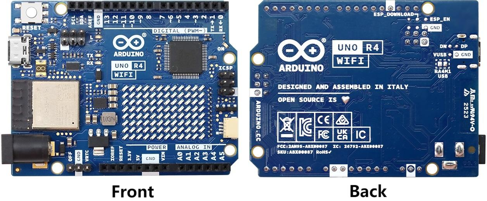

---

### 1. Description

The Arduino UNO R4 WiFi (hereafter for UNO R4 WiFi) is the first UNO board to feature a 32-bit microcontroller and an ESP32-S3 Wi-Fi®module (ESP32-S3-MINI-1-N8). It features a RA4M1 series microcontroller from Renesas (R7FA4M1AB3CFM#AA0), based on a 48 MHz Arm® Cortex®-M4 microprocessor. 

The board features 14 digital I/O ports, 6 analog channels, dedicated pins for I2C, SPI and UART connections. It has a significantly larger memory: 8 times more flash memory (256 kB) and 16 times more SRAM (32 kB). With a 48 MHz clock speed, it is also 3x faster than its predecessors.

In addition, it features an ESP32-S3 module for Wi-Fi® & Bluetooth® connectivity, as well as a built-in 12x8 LED matrix, making it one of the most visually unique Arduino boards to date. The LED matrix is fully programmable, where you can load anything from still frames to custom animations.

The RA4M1's operating voltage is fixed at 5 V, whereas the ESP32-S3 module is 3.3 V. Communication between these two MCUs is performed via a logic-level translator (TXB0108DQSR).

---

### 2. Features

R7FA4M1AB3CFM#AA0, also called RA4M1, is the main MCU on UNO R4 WiFi board, which connects to all pins on the board and all communication buses.

- Overview

  - 48 MHz Arm® Cortex®-M4 microprocessor with a floating point unit (FPU)
  - 5 V operating voltage
  - Real-time Clock (RTC)
  - Memory Protection Unit (MPU)
  - Digital Analog Converter (DAC)
  
- Memory
  
  - 256 kB Flash Memory
  - 32kB SRAM
  - 8 kB Data Memory (EEPROM)

- Peripherals

  - Capacitive Touch Sensing Unit (CTSU)
  - USB 2.0 Full-Speed Module (USBFS)
  - 14-bit ADC
  - up to 12-bit DAC
  - Operational Amplifier (OPAMP)

- Power
  
  - RA4M1 operating voltage is 5V
  - Recommended input voltage (VIN) is 6-24 V
  - Barrel jack connected to VIN pin (6-24V)
  - Power via USB-C® at 5 V

- Communication

  - 1x UART (pin D0, D1)
  - 1x SPI (pin D10-D13, ICSP header)
  - 1x I2C (pin A4, A5, SDA, SCL)
  - 1x CAN (pin D4, D5, external transceiver is required)

- Operating temperature: -40℃~85℃

esp32 - s3 mini -1- n8 is a secondary MCU with a built-in antenna for Wi-Fi® and Bluetooth® connection. This module works at 3.3V, and communicates with RA4M1 through a logical level translator (TXB0108DQSR).

- Overview

  - Xtensa® Dual-core 32-bit LX7 microprocessor
  - Operating voltage of 3.3V
  - 40 MHz crystal oscillator

- Wi-Fi®

  - Wi-Fi® supports 802.11 b/g/n standard (Wi-Fi®4)
  - Bit rate up to 150 Mbps
  - Frequency band of 2.4 GHz

- Bluetooth®

  - Bluetooth® 5

---

### 3. Functions

#### 3.1. Board Topology

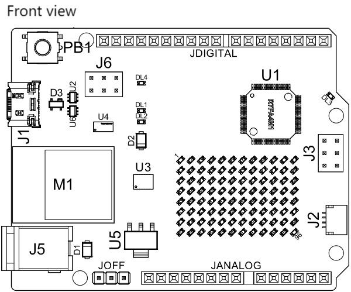

| Ref. | Description |
| :--: | :--: |
| U1 | R7FA4M1AB3CFM#AA0 Microcontroller IC |
| U2 | NLASB3157DFT2G multiplexer |
| U3| ISL854102FRZ-T Buck converter |
| U4 | TXB0108DQSR Logic level converter（5 V - 3.3 V） |
| U5 | SGM2205-3.3XKC3G/TR 3.3 V Linear voltage regulator |
| U6 | NLASB3157DFT2G multiplexer |
| U_LEDMATRIX | 12x8 LED red matrix |
| M1 | ESP32-S3-MINI-1-N8 |
| PB1  | RESET button |
| JANALOG  | Analog input/output headers |
| JDIGITAL | Digital input/output headers |
| JOFF | OFF, VRTC headers |
| J1 | CX90B-16P USB-C® connector |
| J2 | SM04B-SRSS-TB(LF)(SN) I2C connector |
|  J3  | ICSP headers (SPI) |
| J5   | DC power jack |
|  J6  | ESP headers |
|  DL1   | LED TX (serial transmit) |
|  DL2   | LED RX (serial receive) |
|  DL3   | LED Power (green) |
|  DL4   |LED SCK (serial clock)   |
|  D1   |PMEG6020AELRX Schottky Diode   |
|  D2   |PMEG6020AELRX Schottky Diode   |
|  D3   | PRTR5V0U2X, 215 ESD Protection |

#### 3.2. Microcontroller (R7FA4M1AB3CFM#AA0)

The UNO R4 WiFi is based on the 32-bit RA4M1 series microcontroller, R7FA4M1AB3CFM#AA0, from Renesas, which uses a 48 MHz Arm® Cortex®-M4 microprocessor with a floating point unit (FPU).

On the board, the operating voltage is fixed at 5 V to be fully retro compatible with shields, accessories & circuits originally designed for older UNO revisions.

The R7FA4M1AB3CFM#AA0 features:

- 256 kB flash / 32 kB SRAM / 8 kB data flash (EEPROM)
- Real-time Clock (RTC)
- 4x Direct Memory Access Controller (DMAC)
- up to 14-bit ADC
- up to 12-bit DAC
- OPAMP
- 1x CAN bus

#### 3.3. Wi-Fi® / Bluetooth® Module (ESP32-S3-MINI-1-N8)

The Wi-Fi® / Bluetooth® LE module on the UNO R4 WiFi is from the ESP32-S3 SoCs. It features the Xtensa® dual-core 32-bit LX7 MCU, a built-in antenna and support for 2.4 GHz bands.

The ESP32-S3-MINI-1-N8 features:

- Wi-Fi® 4 - 2.4 GHz band
- Bluetooth® 5 LE support
- 3.3 V operating voltage
- 384 kB ROM
- 512 kB SRAM
- Up to 150 Mbps bit rate

This module acts as a secondary MCU on the UNO R4 WiFi, and communicates with the RA4M1 MCU using a logic-level translator. Note that this module operates on 3.3 V as opposed to the RA4M1's 5 V operating voltage.

#### 3.4. ESP Header

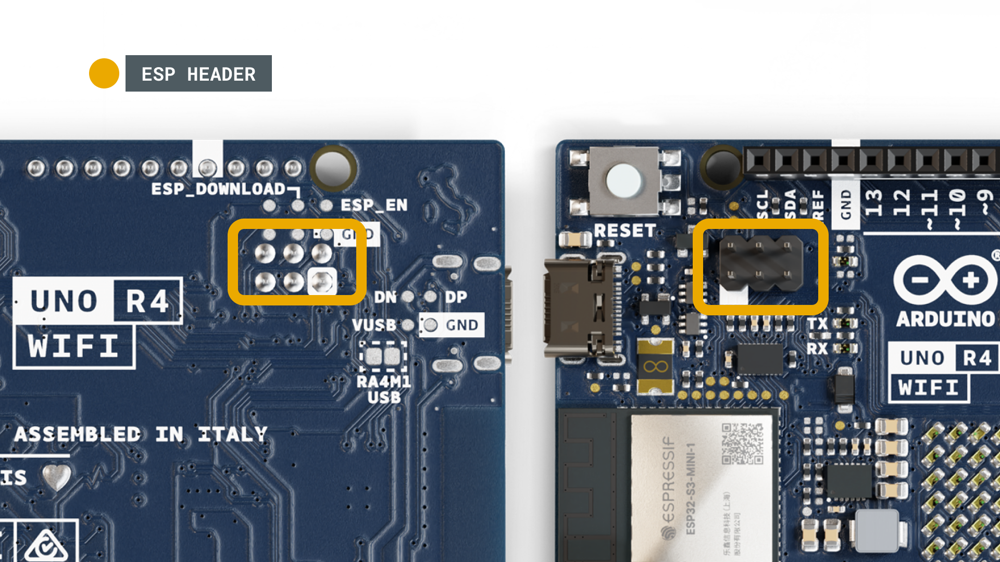

The header located close to the RESET button can be used to access the ESP32-S3 module directly. The pins
accessible are:

- ESP_IO42 - MTMS debugging (Pin 1)
- ESP_IO41 - MTDI debugging (Pin 2)
- ESP_TXD0 - Serial Transmit (UART) (Pin 3)
- ESP_DOWNLOAD - boot (Pin 4)
- ESP_RXD0 - Serial Receive (UART) (Pin 5)
- GND - ground (Pin 6)

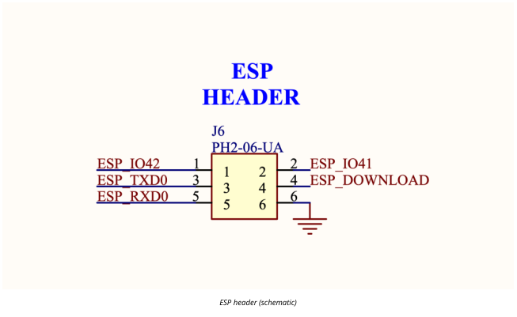

#### 3.5. USB Bridge

When programming the UNO R4 WiFi, the RA4M1 MCU is programmed via the ESP32-S3 module by default. The U2 and U6 switches can switch the USB communication to go directly to the RA4M1 MCU, by writing a high state to the P408 pin (D40).

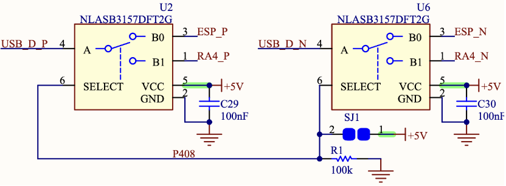

Soldering together the SJ1 pads permanently sets the USB communication directly to the RA4M1, bypassing the ESP32-S3.

#### 3.6. USB Connector

The UNO R4 WiFi has one USB-C® port, used to power and program your board as well as sending & receiving serial communication.

NOTE: The board should not be powered with more than 5 V via the USB-C® port.

#### 3.7. LED Matrix

The UNO R4 WiFi features a 12x8 matrix of red LEDs (U_LEDMATRIX), connected using the technique known as charlieplexing. The following pins on the RA4M1 MCU are used for the matrix:

- P003
- P004
- P011
- P012
- P013
- P015
- P204
- P205
- P206
- P212
- P213

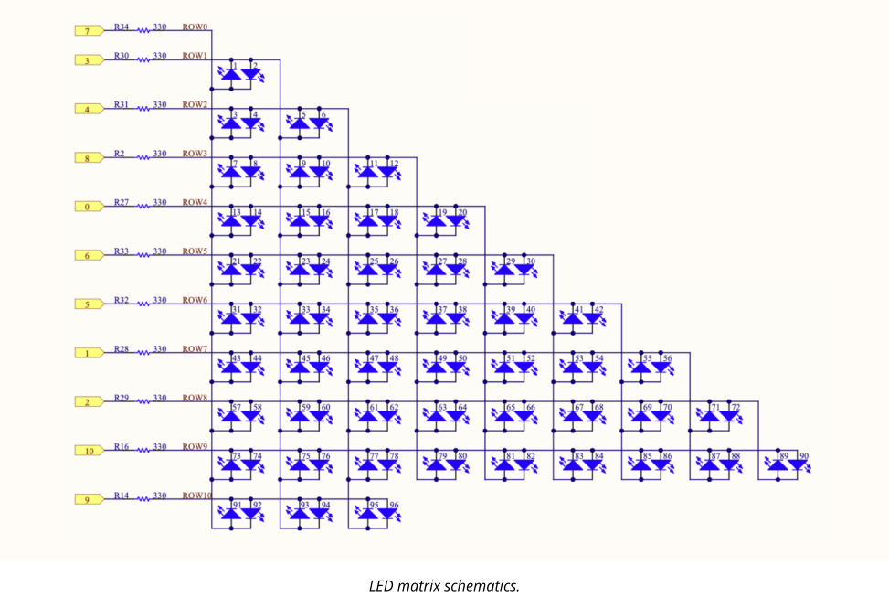

These LEDs can be accessed as an array, using a specific library. See the mapping below:

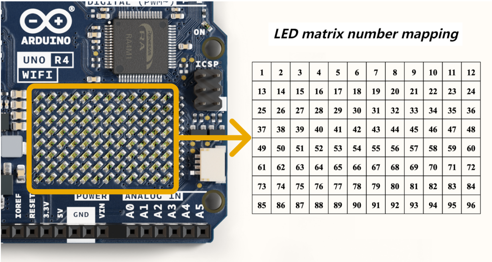

This matrix can be used for a number of projects and prototyping purposes, and supports animation, simple game designs and scrolling text among other things.

#### 3.8. Digital Analog Converter (DAC)

The UNO R4 WiFi has a DAC with up to 12-bit resolution attached to the A0 analog pin. A DAC is used to convert a digital signal to an analog signal.

The DAC can be used for signal generation for e.g. audio applications, like generating and altering sawtooth waves.

#### 3.9. I2C Connector

The I2C connector SM04B-SRSS-TB(LF)(SN) is connected to a secondary I2C bus on the board. 

Note that this
connector is powered via 3.3 V.

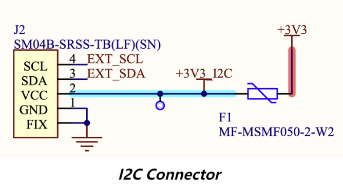

This connector also shares the following pin connections:

JANALOG headers
- A4
- A5

JDIGITAL headers
- SDA
- SCL

NOTE: as A4/A5 is connected to the main I2C bus, these should not be used as ADC inputs whenever the bus is in use. You can however connect I2C devices to each of these pins and connectors simultaneously.

#### 3.10. Power Options

Power can either be supplied via the VIN pin, or via USB-C® connector. If power is supplied via VIN, the
ISL854102FRZ buck converter steps the voltage down to 5 V.

Both VUSB and VIN pins are connected to the ISL854102FRZ buck converter, with Schottky diodes in place for reverse polarity & overvoltage protection respectively.

Power via USB supplies about ~4.7 V (due to Schottky drop) to the RA4M1 MCU.

The linear regulator (SGM2205-3.3XKC3G/TR) converts 5 V from either the buck converter or USB, and provides 3.3V to a number of components, including the ESP32-S3 module.

- Power Tree

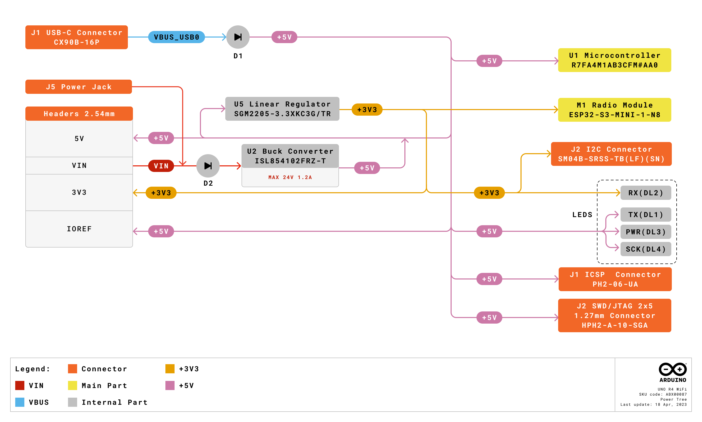

- Pin Voltage

The general operating voltage for UNO R4 WiFi is 5 V, however the ESP32-S3 module's operating voltage is 3.3 V.

NOTE: It is very important that ESP32-S3's pins (3.3 V) do not come in contact with any of the RA4M1's pins (5 V), as this may damage the circuits.

- Pin Current

The GPIOs on the R7FA4M1AB3CFM#AA0 microcontroller can safely handle up to 8 mA of current. Never connect devices that draw higher current directly to a GPIO as this may damage the circuit.

For powering e.g. servo motors, always use an external power supply.

---

### 4. Pin-out

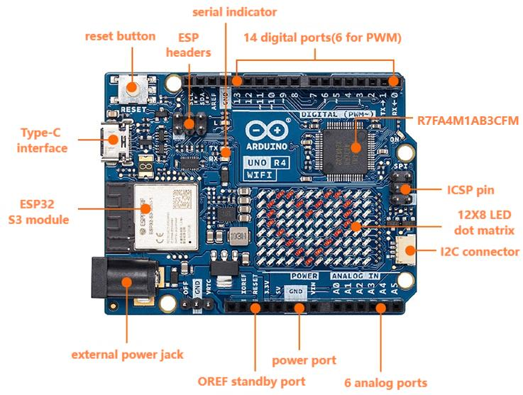

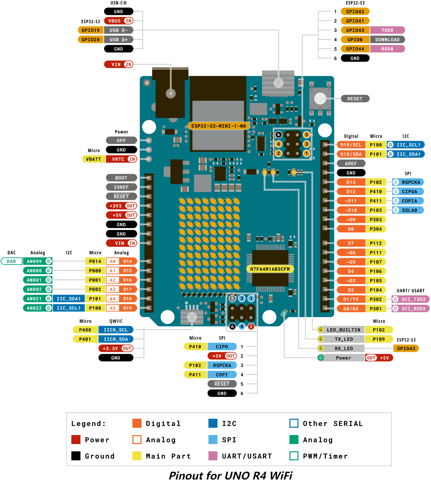

#### 4.1. Analog

| Pin | Function |Type | Description |
| :--: | :--: | :--: | :--: |
| 1 | BOOT  | NC | Not Connected |
| 2 | IOREF |IOREF | Reference for digital logic V - connected to 5 V |
| 3 | Reset  |Reset | Reset |
| 4 |+3V3 | Power | +3V3 Power Rail |
| 5 | +5V | Power | +5V Power Rail |
| 6 | GND | Power | Ground |
| 7 | GND| Power | Ground |
| 8 | VIN | Power | Voltage Input |
| 9 | A0  |Analog | Analog input 0 / DAC |
| 10 |A1 | Analog | Analog input 1 / OPAMP+ |
| 11 | A2 | Analog | Analog input 2 / OPAMP- |
| 12 |A3 | Analog | Analog input 3 / OPAMPOut |
| 13 | A4 | Analog | Analog input 4 / I2C Serial Datal (SDA) |
| 14 | A5 | Analog | Analog input 5 / I2C Serial Clock (SCL) |

#### 4.2. Digital

| Pin  |    Function    |  Type   |                      Description                       |
| :--: | :--: | :--: | :--: |
| 1 | SCL  | Digital | I2C Serial Clock (SCL) |
| 2 | SDA  |Digital| I2C Serial Datal (SDA) |
| 3 | AREF  |Digital | Analog Reference Voltage |
| 4 |GND | Power | ground |
| 5 | D13/SCK/CANRX0 | Digital | GPIO 13 / SPI Clock / CAN Receiver (RX) |
| 6 | D12/CIPO | Digital | GPIO 12 / SPI Controller In Peripheral Out |
| 7 | D11/COPI | Digital |GPIO 11 (PWM) / SPI Controller Out Peripheral In |
| 8 | D10/CS/CANTX0 | Digital | GPIO 10 (PWM) / SPI Chip Select / CAN Transmitter (TX) |
| 9 | D9  |Digital | GPIO 9 (PWM~) |
| 10 |D8 | Digital | GPIO 8 |
| 11 | D7 | Digital |GPIO 7 |
| 12 |D6 | Digital |GPIO 6 (PWM~) |
| 13 | D5 | Digital | GPIO 5 (PWM~) |
| 14 | D4 | Digital |GPIO 4 |
| 15   | D3   | Digital |GPIO 3 (PWM~) / Interrupt Pin |
| 16   |  D2  |Digital |GPIO 2 / Interrupt Pin |
| 17   |  D1/TX0 |Digital  | GPIO 1 / Serial 0 Transmitter (TX) |
|  18  |  D0/TX0  |Digital | GPIO 0 / Serial 0 Receiver (RX) |

#### 4.3. OFF

| Pin  | Function | Type  |             Description              |
| :--: | :--: | :--: | :--: |
| 1 | OFF  |Power | For controlling power supply |
| 2 |GND  |Power | Ground |
| 1 |VRTC  |Power |Battery connection to power RTC only |

#### 4.4. ICSP

| Pin  | Function |   Type   |         Description          |
| :--: | :--: | :--: | :--: |
| 1 |CIPO  | Internal |Controller In Peripheral Out |
| 2 | +5V  | Internal | 5V Power |
| 3 |SCK  |Internal |Serial Clock |
| 4 |COPI | Internal |Controller Out Peripheral In |
| 5 | RESET  | Internal | Reset |
| 6 |GND | Internal |Ground|

For more information of UNO R4 WiFi board, please visit: [https://docs.arduino.cc/hardware/uno-r4-wifi/](https://docs.arduino.cc/hardware/uno-r4-wifi/)

---

## Ⅱ. UNO R4 Minima Board

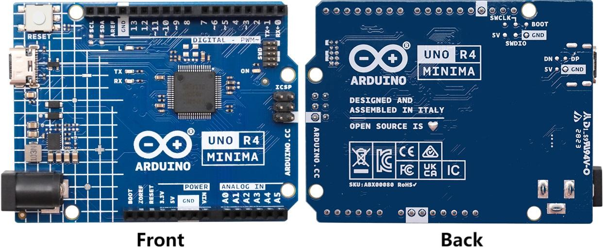

---

### 1. Description

The Arduino® UNO R4 Minima is the first UNO board to feature a 32-bit microcontroller. It features a RA4M1 series microcontroller from Renesas (R7FA4M1AB3CFM#AA0), which embeds a 48 MHz Arm® Cortex®-M4 microprocessor. 

The board features the standard 14 digital I/O ports, 6 analog channels, dedicated pins for I2C, SPI and UART connections. Compared to its predecessors the board has a much larger memory: 8 times more flash memory (256 kB) and 16 times more SRAM (32 kB) as well as 8 kB data memory (EEPROM).

has a barrel jack connector and supports input voltages from 6-24 V. This connector is widely popular and removes the need for additional circuitry required to step down the voltage.

The UNO R4 Minima board's operating voltage is 5 V, making it hardware compatible with UNO form factor
accessories with the same operating voltage. Shields designed for previous UNO revisions are therefore safe to use with this board but are not guaranteed to be software compatible due to the change of microcontroller.

---

### 2. Features

- R7FA4M1AB3CFM#AA0
  - 48 MHz Arm® Cortex®-M4 microprocessor with a floating point unit (FPU).
  - 5V operating voltage
  - Real-time Clock (RTC)
  - Memory Protection Unit (MPU)
  - Digital-to-analog Converter (DAC)
  
- Memory
  
  - 256kB flash memory
  - 32kB SRAM
  - 8 kB Data Memory (EEPROM)

- Header
  - 14 digital I/O pins (GPIO), D0-D13
  - 6 analog input pins (ADC), A0-A5
  - 6  PWM pins: D3, D5, D6, D9, D10, D11

- Peripherals

  - Capacitive Touch Sensing Unit (CTSU)
  - USB 2.0 Full-Speed Module (USBFS)
  - Up to 14-bit ADC
  - Up to 12-bit DAC
  - Operational Amplifier (OPAMP)

- Power
  
  - Operating voltage is 5V
  - Recommended input voltage (VIN) is 6-24 V
  - Barrel jack connected to VIN pin (6-24 V)
  - Power via USB-C® at 5 V
  - Schottky diodes are used for over-voltage and reverse polarity protection

- Communication

  - 1x UART (D0, D1)
  - 1x SPI (D10-D13, ICSP header)
  - 1x I2C (A4, A5,  SDA, SCL)
  - 1x CAN (D4, D5, external transceiver is required)

- Operating temperature: -40℃~85℃

---

### 3. Functions

#### 3.1. Board Topology

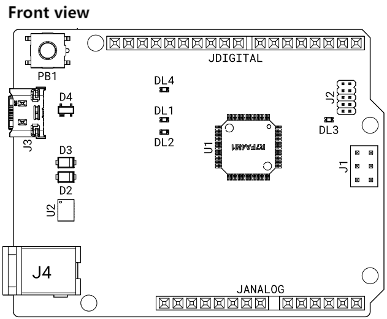

|   Ref.   |             Description              |
| :--: | :--: |
| U1 | R7FA4M1AB3CFM#AA0 Microcontroller IC |
| U2 | ISL854102FRZ-T Buck Converter |
| PB1| RESET Button |
| JANALOG  | Analog input/output headers |
| JDIGITAL | Digital input/output headers |
| J1 | ICSP header (SPI) |
| J2 |SWD/JTAG Connector  |
| J3 |CX90B-16P USB-C® Connector |
|  J4  | DC Jack |
|  DL1   | LED TX (serial transmit) |
|  DL2   | LED RX (serial receive) |
|  DL3   | LED Power (green) |
|  DL4   |LED SCK (serial clock)   |
|  D2   |PMEG6020AELRX Schottky Diode   |
|  D3   |PMEG6020AELRX Schottky Diode   |
|  D4   | PRTR5V0U2X, 215 ESD Protection |

#### 3.2. Microcontroller (R7FA4M1AB3CFM#AA0)

The UNO R4 Minima is based on the 32-bit RA4M1 series microcontroller, R7FA4M1AB3CFM#AA0, from Renesas, which uses a 48 MHz Arm® Cortex®-M4 microprocessor with a floating point unit (FPU).

On the UNO R4 Minima, the operating voltage is fixed at 5 V to be fully retro compatible with shields, accessories & circuits originally designed for older UNO revisions.

The R7FA4M1AB3CFM#AA0 features:

- 256 kB flash / 32 kB SRAM / 8 kB data flash (EEPROM)
- Real-time Clock (RTC)
- 4x Direct Memory Access Controller (DMAC)
- up to 14-bit ADC
- up to 12-bit DAC
- OPAMP
- CAN bus

#### 3.3. USB Connector

The UNO R4 Minima has one USB-C® port, used to power and program your board as well as send & receive serial communication.

NOTE: You should not power the board with more than 5 V via the USB-C® port.

#### 3.4. Digital Analog Converter (DAC)

The UNO R4 Minima has a DAC with up to 12-bit resolution attached to the A0 analog pin. A DAC is used to convert a digital signal to an analog signal.

#### 3.5. Power Options

Power can either be supplied via the VIN pin, the barrel jack, or via USB-C® connector. If power is supplied via VIN, the ISL854102FRZ buck converter steps the voltage down to 5 V.

The VUSB, barrel jack connector and VIN pins are connected to the ISL854102FRZ buck converter, with Schottky diodes in place for reverse polarity & overvoltage protection respectively.

Power via USB supplies about ~4.7 V (due to Schottky drop) to the RA4M1 microcontroller.

- Power Tree

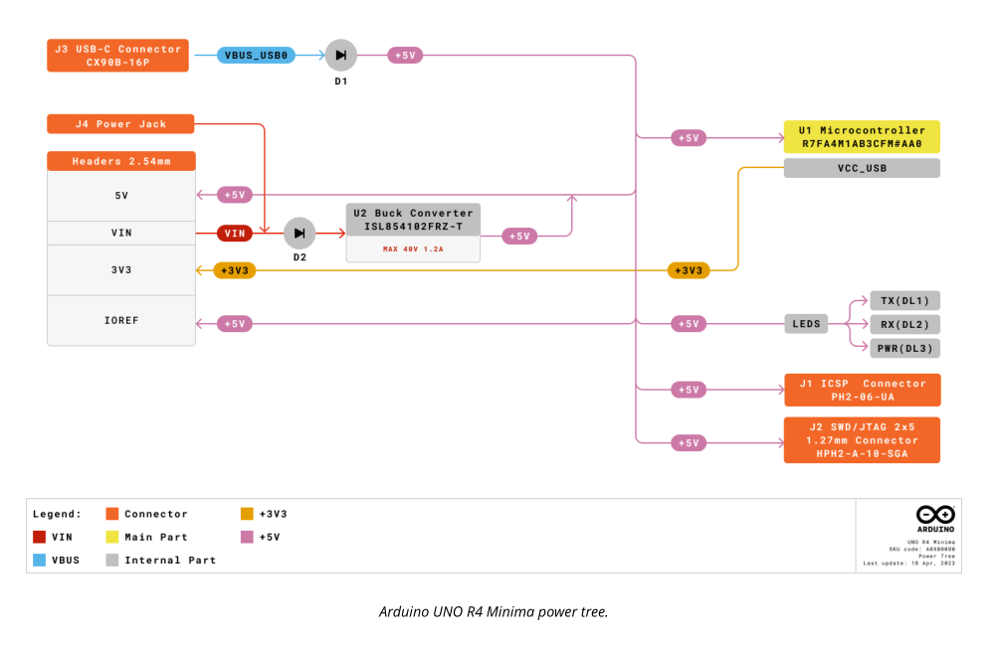

- Pin Voltage

The UNO R4 Minima operates on 5 V, as does all pins on this board except for the 3.3V pin. This pin draws power from the VCC_USB pin on the R7FA4M1AB3CFM#AA0, and is not connected to the buck converter.

- Pin Current

The GPIOs on the R7FA4M1AB3CFM#AA0 microcontroller can handle up to 8 mA. Never connect devices that draw higher current directly to a GPIO.

In case you need to power external devices that require more power, e.g. servo motors, use an external power supply.

### 4. Pin-out

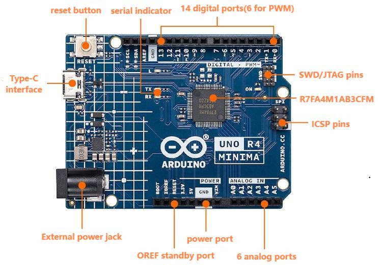

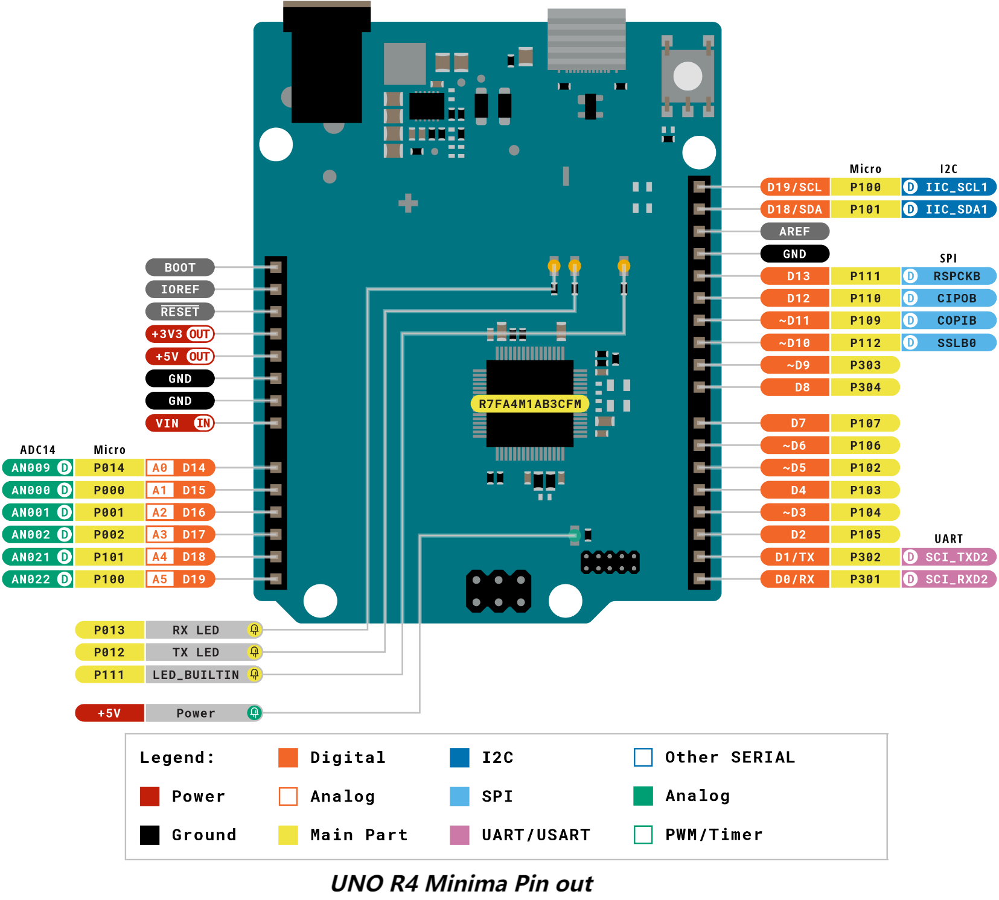

#### 4.1. Analog

| Pin  | Function |  Type  |                   Description                    |
| :--: | :--: | :--: | :--: |
| 1 | BOOT  | MD | Mode selection |
| 2 | IOREF |IOREF | Reference for digital logic V - connected to 5 V |
| 3 | Reset  | Reset  | Reset |
| 4 |+3V3 | Power | +3V3 Power Rail |
| 5 | +5V | Power | +5V Power Rail |
| 6 | GND | Power | Ground |
| 7 | GND| Power | Ground |
| 8 | VIN | Power | Voltage Input |
| 9 | A0  |Analog | Analog input 0 / DAC |
| 10 |A1 | Analog | Analog input 1 / OPAMP+ |
| 11 | A2 | Analog | Analog input 2 / OPAMP- |
| 12 |A3 | Analog | Analog input 3 / OPAMPOut |
| 13 | A4 | Analog | Analog input 4 / I2C Serial Datal (SDA) |
| 14 | A5 | Analog | Analog input 5 / I2C Serial Clock (SCL) |

#### 4.2. Digital

| Pin  | Function  |  Type   |                   Description                    |
| :--: | :--: | :--: | :--: |
| 1 | SCL  | Digital | I2C Serial Clock (SCL) |
| 2 | SDA  |Digital | I2C Serial Datal (SDA) |
| 3 | AREF  |Digital | Analog Reference Voltage |
| 4 |GND | Power | Ground |
| 5 | D13/SCK | Digital | GPIO 13 / SPI Clock |
| 6 | D12/CIPO | Digital | GPIO 12 / SPI  Controller In Peripheral Out |
| 7 | D11/COPI | Digital |GPIO 11（PWM）/ SPI Controller Out Peripheral In |
| 8 | D10/CS| Digital | GPIO 10（PWM）/ SPI Chip Select |
| 9 | D9  |Digital | GPIO 9 (PWM~) |
| 10 |D8 | Digital | GPIO 8 |
| 11 | D7 | Digital |GPIO 7 |
| 12 |D6 | Digital |GPIO 6 (PWM~) |
| 13 |D5/CANRX0 | Digital |GPIO 5（PWM~）/ CAN  Transmitter (TX) |
| 14 |D4/CANTX0 | Digital |GPIO 4 / CAN Receiver (RX) |
| 15   | D3   | Digital |GPIO 3 (PWM~) /  Interrupt Pin |
| 16   |  D2  |Digital |GPIO 2 / Interrupt Pin |
| 17   |  D1/TX0 |Digital  | GPIO 1 / Serial 0 Transmitter (TX) |
|  18  |  D0/RX0  |Digital | GPIO 0 / Serial 0 Receiver (RX) |

#### 4.3. ICSP

| Pin  | Function |   Type   |         Description          |
| :--: | :--: | :--: | :--: |
| 1 |CIPO  | Internal |Controller In Peripheral Out |
| 2 | +5V  |Internal | 5V Power |
| 3 |SCK  |Internal |Serial Clock |
| 4 |COPI | Internal |Controller Out Peripheral In |
| 5 | RESET  | Internal | Reset |
| 6 |GND | Internal |Ground|

#### 4.4. SWD/JTAG

| Pin  | Function |   Type   |     Description     |
| :--: | :--: | :--: | :--: |
| 1 |+5V  | Internal |Power Supply of 5 V |
| 2 |SWDIO   |Internal | Data I/O pin |
| 3 |GND  |Internal |Ground |
| 4 |SWCLK  | Internal |Clock Pin |
| 5 |GND  | Internal | Ground |
| 6 |NC | Internal |Not connected|
| 7 | RX | Internal |Serial Receiver |
|8  | TX  | Internal |Serial Transmitter |
|  9| GND  | Internal |Ground |
| 10 |NC  | Internal | Not connected |

For more information of UNO R4 Minima board, please visit: [https://docs.arduino.cc/hardware/uno-r4-minima/](https://docs.arduino.cc/hardware/uno-r4-minima/)

